# UML Studio

**Visit the site with github pages: <https://yavuzyunusoglu.github.io/UMLEditor/>**

A free, offline-first **UML class diagram and flowchart editor** for the browser, with **Unity shortcuts** and **C# import/export**. It runs in the browser and works on desktop, tablet and phone. There is nothing to install, and an optional **Google Drive** sync lets you start a diagram on one device and continue on another.

> [!IMPORTANT]
> **This project was generated with AI.**
> The source code, tests, icons, screenshots and this README were written by **Claude (Anthropic's Claude Opus 5.5 model, used through Claude Code)** in response to plain-language requests from the repository owner. The owner described the features and Claude wrote the implementation.
> Claude also ran automated tests (unit tests plus scripted runs in a headless browser on desktop, tablet and phone screen sizes). No human has reviewed the code line by line. Treat it like any other unaudited code, and review it before you rely on it for anything important.

> [!NOTE]
> The app is available in **English** and **Turkish**. It starts in Turkish if your system language is Turkish, and in English otherwise; switch any time with the **globe (EN/TR)** button in the top bar. A Turkish version of this guide (with Turkish screenshots) is in [README.tr.md](README.tr.md).

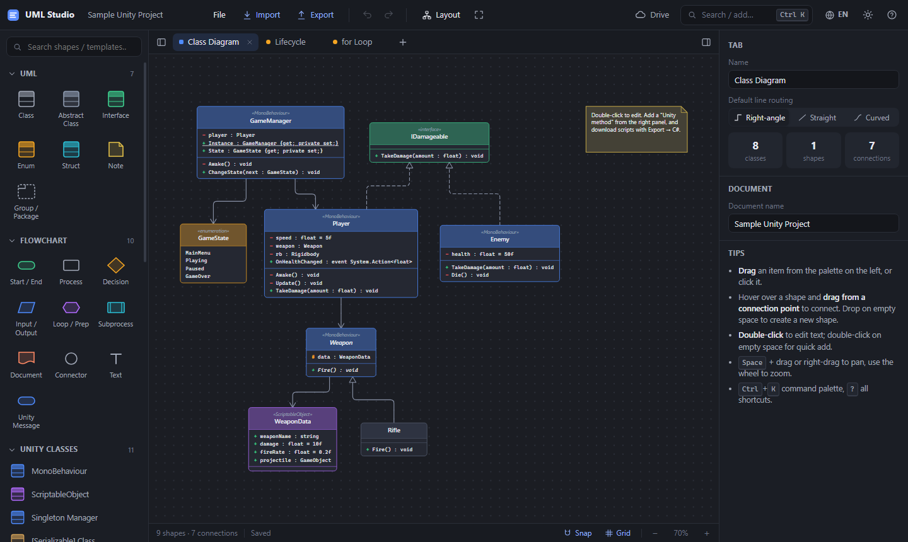

---

## Contents

- [Features](#features)
- [Quick start](#quick-start)
- [How to use](#how-to-use)
  - [Adding shapes](#1-adding-shapes)
  - [Connecting shapes](#2-connecting-shapes)
  - [Editing classes and Unity shortcuts](#3-editing-classes-and-unity-shortcuts)
  - [Unity templates, patterns and loops](#4-unity-templates-patterns-and-loops)
  - [Exporting C# scripts](#5-exporting-c-scripts)
  - [Importing your existing C# scripts](#6-importing-your-existing-c-scripts)
  - [Exporting images and text formats](#7-exporting-images-and-text-formats)
  - [Google Drive sync](#8-google-drive-sync)
  - [Tablet and phone](#9-tablet-and-phone)
  - [Command palette and shortcuts](#10-command-palette-and-keyboard-shortcuts)
- [Member syntax](#member-syntax)
- [Publishing on GitHub Pages](#publishing-on-github-pages)
- [Setting up Google Drive](#setting-up-google-drive-one-time-5-minutes)
- [Privacy](#privacy)
- [Project structure](#project-structure)
- [Running the tests](#running-the-tests)
- [Adding a language](#adding-a-language)
- [Known limitations](#known-limitations)
- [License](#license)

---

## Features

| | |
|---|---|
| **Class diagrams** | Classes, abstract classes, interfaces, enums, structs, notes and packages/groups. There are seven relationship types (association, inheritance, realization, dependency, aggregation, composition, link) with multiplicity labels. |
| **Flowcharts** | Start/end, process, decision, input/output, loop (preparation), subprocess, document, connector and free text. |
| **Unity shortcuts** | One-click MonoBehaviour, ScriptableObject, Singleton, `[Serializable]`, Custom Editor, EditorWindow, StateMachineBehaviour and more. It also includes ready-made **design patterns**, **loop/flow templates** and menus for **Unity messages and fields**. |
| **C# export** | Unity-ready `.cs` files in a `.zip`, including `[SerializeField]`, `[CreateAssetMenu]`, `[CustomEditor]`, singleton boilerplate, interface stubs, and an `Editor/` folder for editor scripts. |
| **C# import** | Drop `.cs` files or a whole `Assets/Scripts` folder to get a class diagram. Fields, properties, methods, inheritance and references are detected automatically. |
| **Other formats** | PNG (1–4×, transparent background, copy to clipboard), SVG, Mermaid (import and export), PlantUML and JSON. |
| **Languages** | English and Turkish, chosen automatically from your system language, switchable at any time. |
| **Themes** | Dark and light. |
| **Google Drive** | Optional sync to your own Drive, with conflict detection between devices. |
| **Works everywhere** | Desktop, tablet and phone. You can install it to the home screen, and it opens offline. |
| **Editor comforts** | Multiple tabs, undo/redo, copy/paste, alignment guides, snap-to-grid, auto-layout and autosave in the browser. |

---

## Quick start

| How | What to do | Google Drive |
|---|---|---|
| **Fastest** | Double-click `index.html` (Chrome or Edge recommended). | ✗ (does not work over `file://`) |
| **Local server** | Run `python -m http.server 8000` in this folder, then open <http://localhost:8000>. | ✓ |
| **Online** | [Publish on GitHub Pages](#publishing-on-github-pages) and open it on any device. | ✓ |

On first launch, a sample Unity project (a class diagram plus two flowcharts) is loaded so you have something to explore. To start fresh, use **File → New document**.

---

## How to use

### 1. Adding shapes

The **left palette** contains every shape and template. You can **click** an item to drop it in the middle of the view, or **drag** it to a specific spot on the canvas. Use the search box at the top to filter the palette.

You can also **double-click an empty area** of the canvas to open a quick-add search at that position.

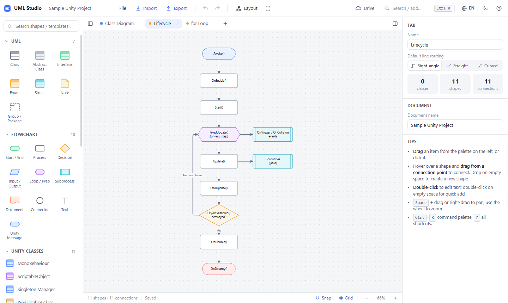

### 2. Connecting shapes

Hover over a shape (or select it) and small **blue connection points** appear around it. Drag from one of them:

- **Drop on another shape** to connect the two.
- **Drop on empty canvas** to create a new shape of the same kind, already connected, and start typing its text immediately. This is the fastest way to build a flowchart.

<p align="center">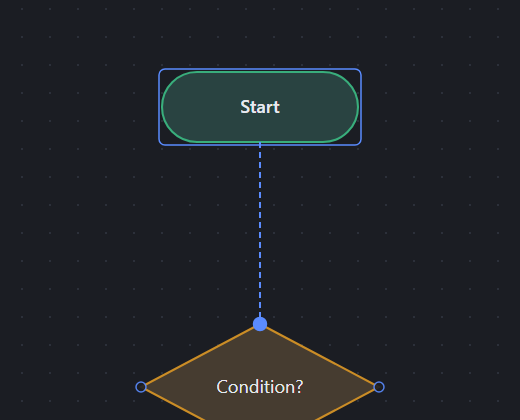</p>

Connection behaviour:
- Lines leaving a **decision** shape are labelled **Yes / No** automatically.
- Click a connection to change its type, labels, multiplicities, routing (right-angle, straight or curved) and line style in the right panel.
- Drag the diamond handle in the middle of a selected line to reroute it.
- Drag a line's end handles to attach it to a different shape.

### 3. Editing classes and Unity shortcuts

**Double-click** a class to edit it in place. Where you double-click decides what you edit: the header edits the **name**, the middle section edits the **fields**, and the bottom section edits the **methods**. Everything is also editable in the **right panel**.

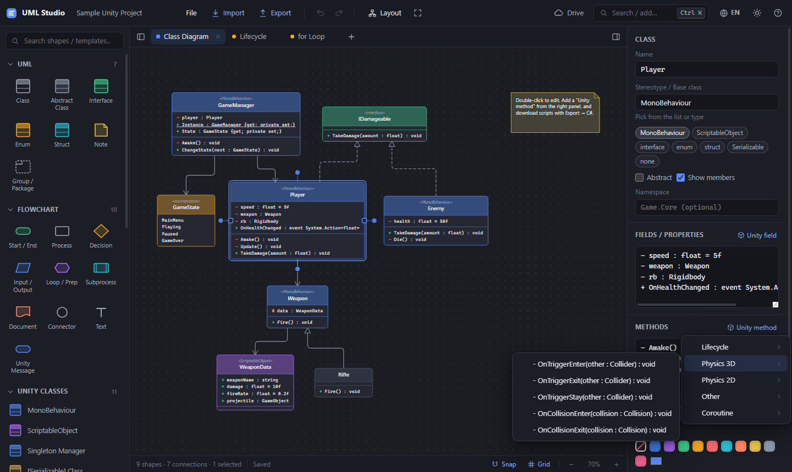

The right panel provides:
- **Stereotype chips** that set the class kind in one click: MonoBehaviour, ScriptableObject, interface, enum, struct and Serializable.
- **Unity method**, which adds lifecycle, physics (3D/2D), gizmo and coroutine methods with the correct signatures.
- **Unity field**, which adds common components and values such as `Rigidbody`, `Animator`, `UnityEvent` and singleton `Instance`.
- **Show code / Download .cs** for the selected class.

### 4. Unity templates, patterns and loops

The palette includes ready-made building blocks:

- **Unity Classes**: MonoBehaviour, ScriptableObject, Singleton Manager, `[Serializable]` class, IDamageable, enum, abstract base, Custom Editor, EditorWindow, static utility and StateMachineBehaviour.
- **Unity Patterns**: State, Observer/Event, Object Pool, ScriptableObject data, Manager structure and Command.
- **Unity Flows & Loops**: the MonoBehaviour lifecycle, `Update` input → movement, `for`, `foreach`, `while`, `do-while`, `if/else`, `switch`, a coroutine spawner, `OnTriggerEnter`, take damage/die, and raycast shooting.

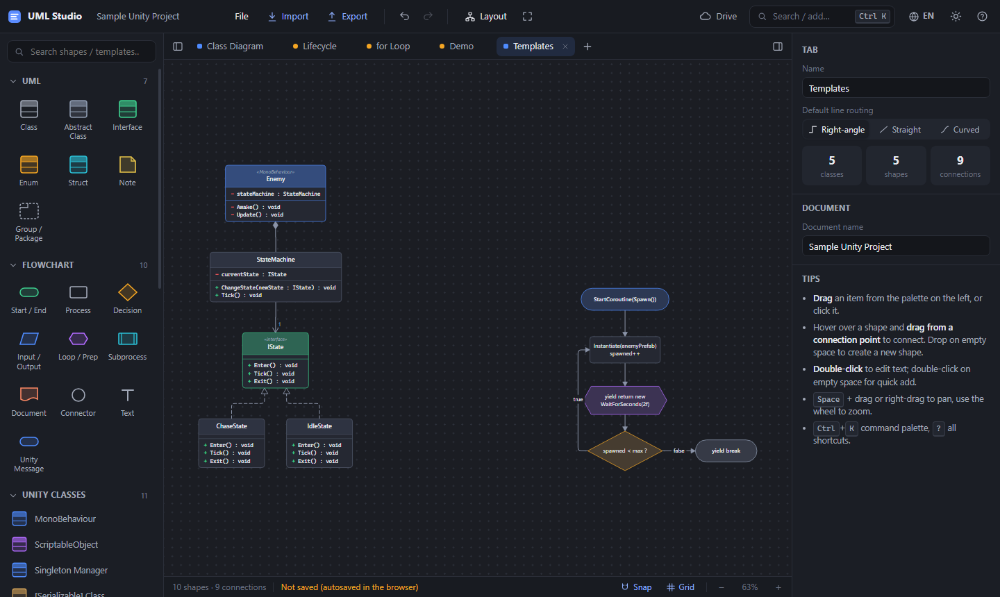

### 5. Exporting C# scripts

Use **Export → C# code preview** to see the generated code, or **Export → C# scripts (.zip)** to download every class as a `.cs` file.

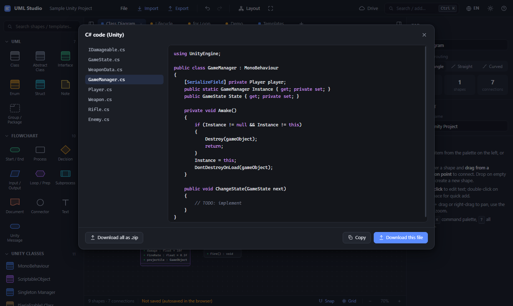

The generator knows the Unity conventions:
- Private fields of Unity classes get `[SerializeField]`.
- ScriptableObjects get `[CreateAssetMenu]`.
- Editors get `[CustomEditor(typeof(...))]` and are placed in an `Editor/` folder.
- A static `Instance` property with an `Awake()` method produces singleton boilerplate.
- Interfaces connected with a *realization* line are implemented automatically.
- `using` directives are added only when they are needed.

### 6. Importing your existing C# scripts

Drag `.cs` files, or an entire `Assets/Scripts` folder, onto the canvas. You can also use **Import → C# folder**. The import dialog shows what was found and lets you include or skip private members, methods and reference relationships.

<p align="center">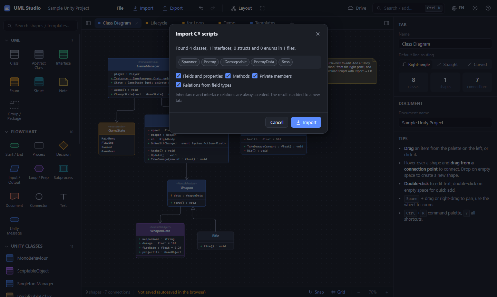 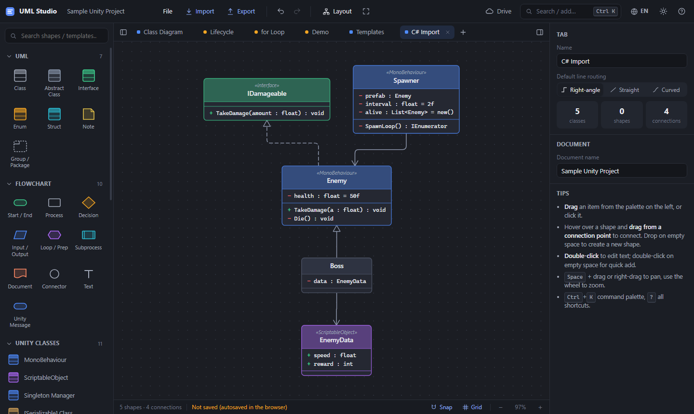</p>

The result is placed in a new tab and laid out automatically, with base classes on top:
- Inheritance and interfaces become lines.
- Fields that refer to other classes become associations, marked `*` for collections.
- Partial classes are merged into one.
- `Library/`, `Temp/` and `obj/` folders are skipped.

### 7. Exporting images and text formats

**Export** offers:

- **PNG** with a live preview, dark or light theme, transparent background, 1–4× scale, and copy-to-clipboard.
- **SVG** vector image.
- **Mermaid** text for GitHub, GitLab, Notion or Obsidian, and **PlantUML** (class diagrams only).
- **JSON**: the native document format, which you can open again later.

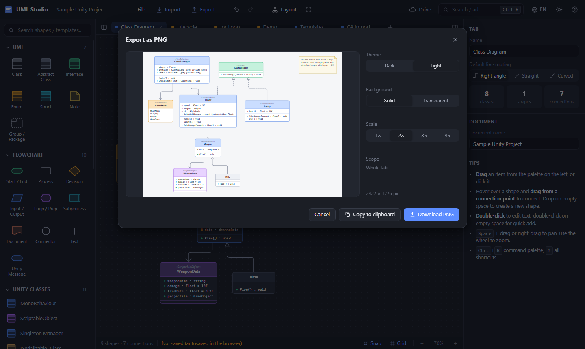

Example of an exported PNG (light theme):

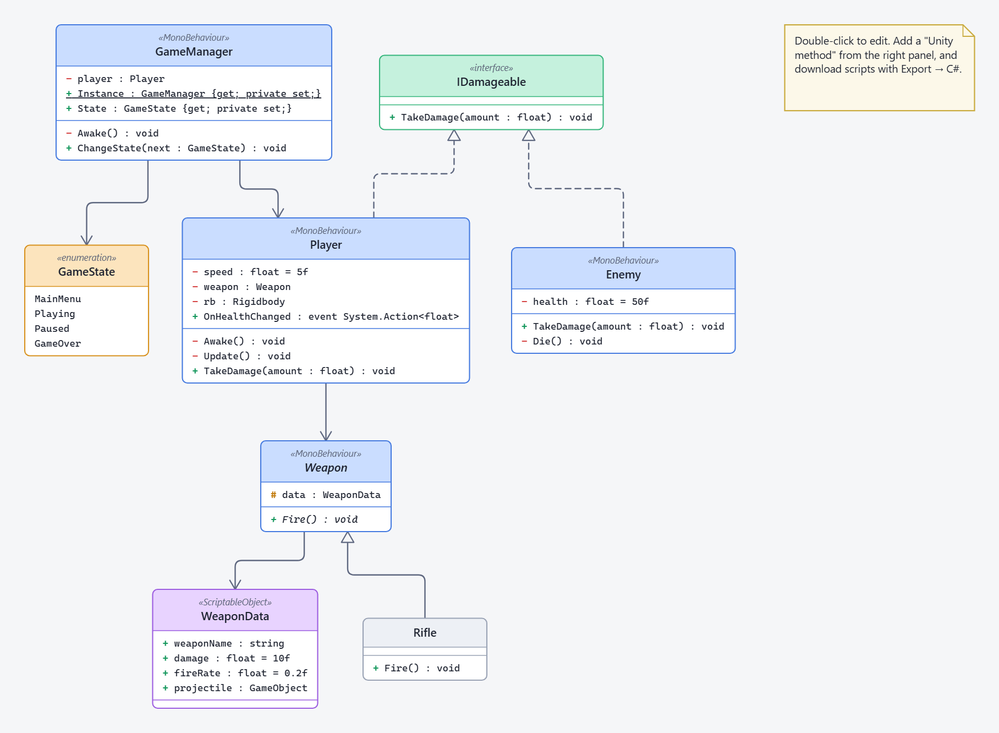

### 8. Google Drive sync

After the [one-time setup](#setting-up-google-drive-one-time-5-minutes), the **Drive** button in the top bar lets you sign in with your own Google account and save diagrams to your Drive.

<p align="center">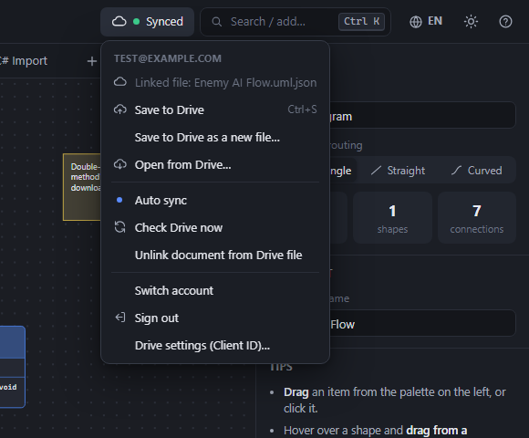 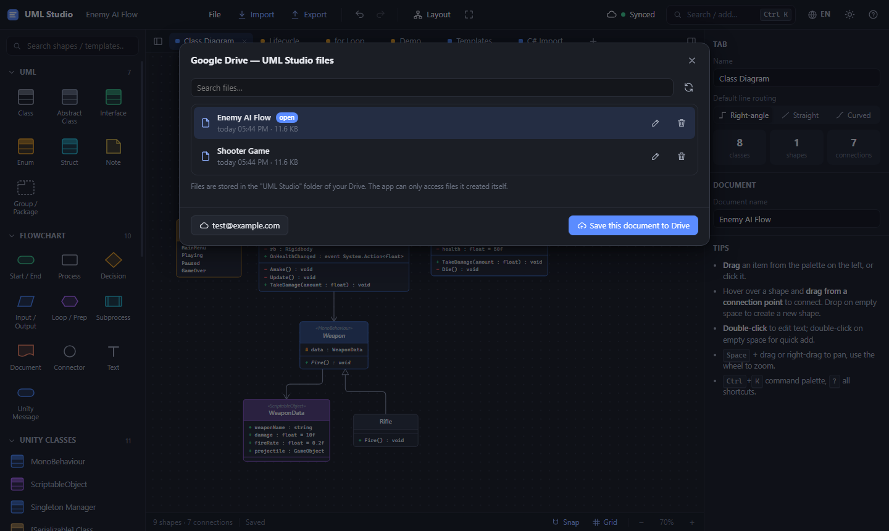</p>

**Typical workflow: start on the PC, continue on the tablet**
1. On the PC, click **Drive → Sign in with Google**, then **Save to Drive**.
2. From then on, every change is **synced automatically** within a few seconds. The indicator shows *Synced* or *Sync pending*. `Ctrl+S` also saves to Drive.
3. On the tablet, open the same URL, then **Drive → Open from Drive…** and pick the file.
4. When you return to a device, the app checks Drive. If you made no local changes there, it loads the newer version automatically.
5. If the same document was changed on **both** devices, a conflict dialog lets you choose between *open the Drive version*, *overwrite*, or *save mine as a copy* (nothing is lost).

Google access tokens last about an hour. When yours expires, the indicator shows *Sign-in required*; one click reconnects you.

### 9. Tablet and phone

<p align="center">
  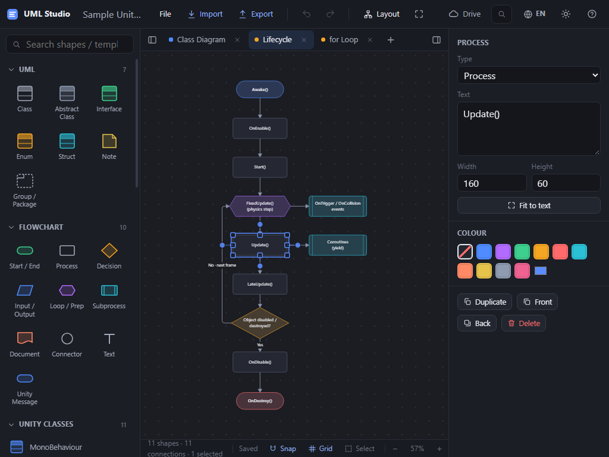
  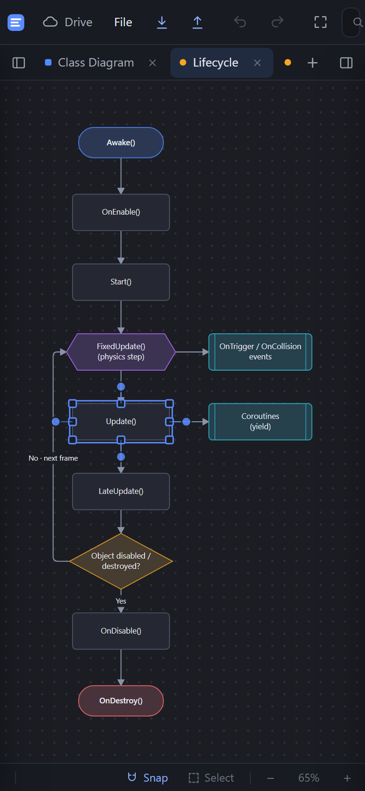
  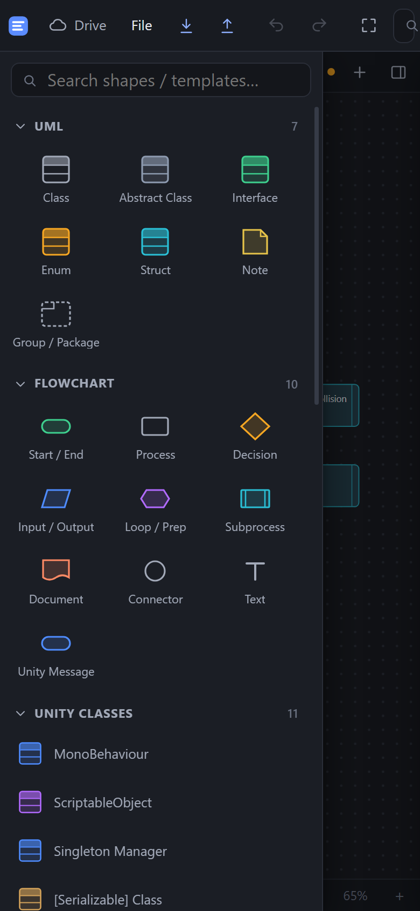
</p>

| Gesture | Action |
|---|---|
| Tap a shape | Select it |
| Drag a shape | Move it |
| Drag empty canvas | Pan |
| Two fingers | Pinch to zoom, and pan |
| Double-tap | Edit text (on empty canvas: quick add) |
| Long-press | Context menu (*Properties* opens the side panel) |
| Drag a blue dot around a selected shape | Draw a connection |
| **Select** button in the bottom bar | Multi-select mode: tap to add shapes, drag on empty canvas to box-select |

On small screens, the palette and the properties panel slide in as drawers; open them with the buttons in the tab bar. In your browser menu, choose **Add to Home Screen** to install the app. It also opens without an internet connection.

### 10. Command palette and keyboard shortcuts

Press `Ctrl+K` (or `/`) to search every shape, Unity template and command.

<p align="center">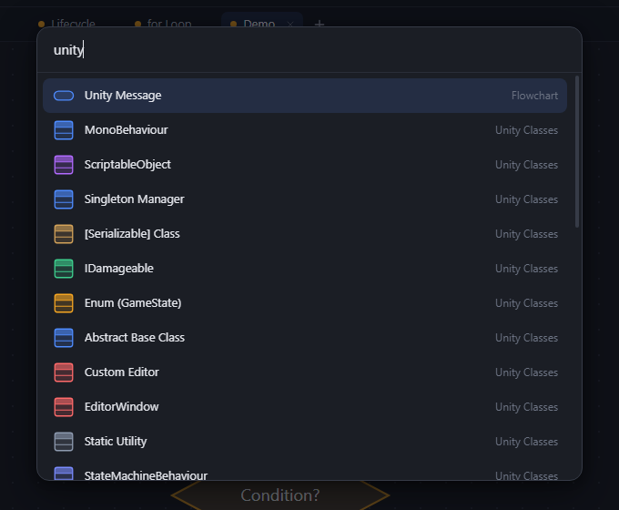</p>

| Shortcut | Action |
|---|---|
| `Ctrl+S` / `Ctrl+Shift+S` | Save (to Drive if the document is linked) / Save as file |
| `Ctrl+O` | Open file |
| `Ctrl+K`, `/` | Command palette / quick add |
| `Ctrl+Z`, `Ctrl+Y` | Undo / redo |
| `Ctrl+C` `Ctrl+X` `Ctrl+V` `Ctrl+D` | Copy / cut / paste / duplicate |
| `Ctrl+A`, `Delete` | Select all, delete |
| `F2` or `Enter` | Edit the selected shape or line |
| Arrow keys (+`Shift`) | Nudge by 1 px (10 px) |
| `Ctrl+G` | Group the selection in a frame |
| Mouse wheel | Zoom |
| `Space` + drag, middle/right drag | Pan |
| `Shift+1`, `Ctrl+0` | Fit to screen, 100 % |
| `Alt` while dragging | Temporarily disable snapping |
| `?` | Show all shortcuts |

Box selection works like most CAD tools: dragging to the right selects shapes **fully inside** the box, and dragging to the left selects shapes the box **touches**.

---

## Member syntax

Class members use a simple UML-style syntax. C#-style lines are also accepted.

```text
- speed : float = 5f                                  private field with a default value
+ Health : int {get; private set;}                    property
+ {static} Instance : GameManager {get; private set;} static property
+ Move(dir : Vector3, speed : float) : void           method
+ {abstract} Fire() : void                            abstract method ({virtual} and {override} also work)
+ OnDied : event Action<int>                          event
public float speed = 5f                               C# style also works
```

Visibility: `+` public · `-` private · `#` protected · `~` internal.
For enums, write one value per line.

---

## Publishing on GitHub Pages

1. Create a new GitHub repository, for example `uml-studio`. On a free plan, the repository must be **public** to use Pages.
2. Push this folder to the root of the repository:
   ```bash
   git init
   git add .
   git commit -m "UML Studio"
   git branch -M main
   git remote add origin https://github.com/YOUR_USERNAME/uml-studio.git
   git push -u origin main
   ```
3. In the repository, go to **Settings → Pages → Build and deployment**, set **Source** to *Deploy from a branch*, choose **Branch** `main` with folder `/ (root)`, then click **Save**.
4. After a minute or two, the app is live at `https://YOUR_USERNAME.github.io/uml-studio/`.

To publish updates, commit and `git push`. The service worker fetches the newest files first, so users get updates on their next visit.

> [!TIP]
> Commits contain the author's email address, and anyone can see it in a public repository. If you don't want your personal address to show, turn on **Settings → Emails → Keep my email addresses private** on GitHub and set the `...@users.noreply.github.com` address shown there with `git config user.email`.

---

## Setting up Google Drive (one-time, ~5 minutes)

Drive sync needs your own free OAuth Client ID from Google Cloud.

1. Go to <https://console.cloud.google.com> and create a new project.
2. **APIs & Services → Library → Google Drive API → Enable.**
3. In **Google Auth Platform** (formerly *OAuth consent screen*):
   - **Branding:** enter an app name and your email address. The *User support email* is shown to everyone who signs in; use a separate account if you don't want your personal address to be visible.
   - **Audience:** choose **External**. While the app is in *Testing* status, only accounts listed under **Test users** can sign in, so add your own Google account there. To let **everyone** use your deployment, click **Publish app** to move it to *In production*. Because the app only uses the `drive.file` scope, Google currently treats it as non-sensitive and does not require an app review.
   - **Data access:** add the scope `https://www.googleapis.com/auth/drive.file`.
4. **Clients → Create client → Web application.**
   - **Authorized JavaScript origins:** `https://YOUR_USERNAME.github.io`. For local testing, also add `http://localhost:8000`.
   - No redirect URI is needed.
5. Copy the Client ID into `js/config.js`:
   ```js
   window.UMLSTUDIO_CONFIG = {
     googleClientId: '1234567890-abc...apps.googleusercontent.com',
   };
   ```
   A Client ID is **not a secret**, so it is safe to commit. The *client secret* that the Google console may show is not used by this app; never put it anywhere. Alternatively, you can paste it in the app under **Drive → Drive settings (Client ID)…**; it is then stored only in that browser.

The Google Cloud project, the Drive API and GitHub Pages are free; no billing account is needed. Each user's files count against their own Drive storage.

---

## Privacy

See the full [Privacy Policy](privacy.html) and [Terms of Service](terms.html). Both are also linked from the app's status bar.

- There is **no backend, analytics or tracking**. The app is a set of static files.
- Your work is autosaved in your **browser's local storage** on each device.
- Drive sync talks directly from your browser to Google, using the **`drive.file`** scope. With this scope, the app can only see files that it created itself; it cannot read anything else in your Drive. Files are stored in a **UML Studio** folder.
- Whoever publishes the app (the repository owner) cannot see users' files; no data passes through them.
- The Google access token is kept in local storage for its lifetime (about one hour) so that a page reload does not force you to sign in again. **Sign out** revokes it.

---

## Project structure

```text
index.html              App shell
css/style.css           UI styles (dark and light themes, responsive layout)
js/config.js            Settings (Google Client ID)
js/i18n.js              English/Turkish translations and language detection
js/util.js, theme.js    Helpers, diagram colour themes
js/uml.js, model.js     UML metadata, member parser, document model, undo/redo store
js/geometry.js          Shape sizes, connection points, line routing
js/render.js            SVG rendering (also used for PNG/SVG export)
js/layout.js            Automatic layered layout
js/templates.js         Palette items: shapes, Unity classes, patterns, flows
js/csharp.js            C# code generator and C# parser
js/mermaid.js           Mermaid import/export, PlantUML export
js/zip.js               Dependency-free ZIP writer
js/io.js                File save/open, image export
js/ui.js, panel.js      Menus, dialogs, properties panel
js/editor.js            Canvas interaction (mouse, touch, pinch, keyboard)
js/drive.js             Google Drive sync
js/app.js               Toolbar, tabs, palette, actions, startup
sw.js, manifest.webmanifest, icons/   Offline support and installable app
tests/                  Unit tests for the logic modules and translation coverage
docs/images/            README screenshots (tr/ holds the Turkish UI versions)
```

There are no dependencies and no build step: plain JavaScript loaded with `<script>` tags.

---

## Running the tests

```bash
node tests/run-tests.js
```

The tests cover the member parser, translation coverage (every UI string has an English translation), C# import and export (including a round trip that regenerates code from every template and parses it again), Mermaid import and export, edge geometry for every template, auto-layout overlap checks, undo/redo, and the ZIP writer.

---

## Adding a language

All interface text goes through `$t('…')` in [`js/i18n.js`](js/i18n.js). The Turkish source string is the key, and each language is a dictionary that maps those keys to translations. To add a language:

1. In `js/i18n.js`, copy the `EN` dictionary, translate the values, and register it in `DICTS` and `LANGS`.
2. Update `systemLang()` if the new language should be picked automatically.
3. Run `node tests/run-tests.js`. The tests fail if a key used in the code is missing from the English dictionary, if a `{placeholder}` or `**bold**` marker is lost in a translation, or if a Turkish string in the code is not wrapped in `$t()`.

---

## Known limitations

- Only English and Turkish are included. Adding a language means adding a dictionary to `js/i18n.js` (see [Adding a language](#adding-a-language)).
- The C# importer is a lightweight parser, not a compiler. It handles typical Unity code well, but unusual syntax may cause some members to be skipped.
- PlantUML export supports class diagrams only. Use Mermaid for flowcharts.
- When several lines meet at the same corner of a decision shape, they can overlap. Reroute a line with its middle handle, or pin its start or end side in the properties panel.
- Google sign-in inside an iOS home-screen app can be unreliable. If that happens, sign in once from Safari.
- Real Google sign-in and real physical tablets were not part of the automated tests. Drive sync was tested against a simulated Drive API, and touch input was tested with emulated devices.

---

## License

This project is licensed under the [MIT License](LICENSE).
