# UML Studio

**English:** [README.md](README.md)

Tarayıcıda çalışan, ücretsiz ve çevrimdışı kullanılabilen bir **UML sınıf diyagramı ve akış şeması editörü**. **Unity kısayolları** ile **C# içe/dışa aktarma** desteği var. Kurulum gerektirmez; bilgisayarda, tablette ve telefonda çalışır. İsteğe bağlı **Google Drive** senkronu sayesinde bir cihazda başladığınız diyagrama başka bir cihazda devam edebilirsiniz.

> [!IMPORTANT]
> **Bu proje yapay zeka ile oluşturulmuştur.**
> Kaynak kod, testler, simgeler, ekran görüntüleri ve bu README, depo sahibinin sade bir dille anlattığı isteklere göre **Claude (Anthropic'in Claude Opus 5.5 modeli, Claude Code üzerinden)** tarafından yazıldı. Özellikleri depo sahibi tanımladı, uygulamayı Claude yazdı.
> Claude otomatik testler de çalıştırdı: birim testleri ve bilgisayar, tablet ve telefon ekran boyutlarında headless tarayıcıyla betikli denemeler. Kod satır satır insan incelemesinden geçmedi. Önemli bir işte kullanmadan önce, denetlenmemiş herhangi bir kod gibi gözden geçirin.

> [!NOTE]
> Uygulama **Türkçe** ve **İngilizce** kullanılabilir. Sistem diliniz Türkçe ise Türkçe, değilse İngilizce açılır; üst çubuktaki **küre (EN/TR)** düğmesiyle istediğiniz zaman değiştirebilirsiniz. Seçiminiz hatırlanır.

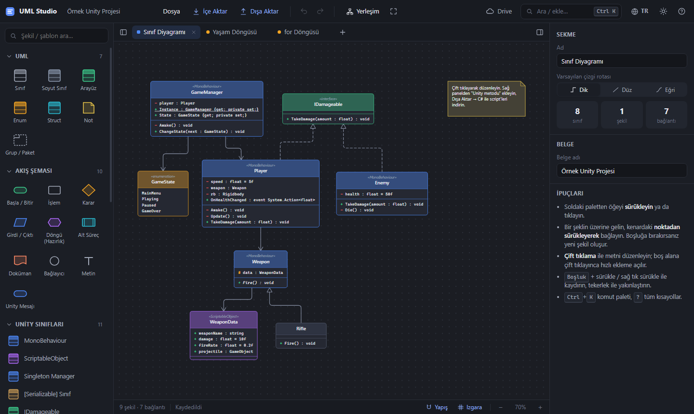

---

## İçindekiler

- [Özellikler](#özellikler)
- [Hızlı başlangıç](#hızlı-başlangıç)
- [Nasıl kullanılır](#nasıl-kullanılır)
  - [Şekil ekleme](#1-şekil-ekleme)
  - [Şekilleri bağlama](#2-şekilleri-bağlama)
  - [Sınıfları düzenleme ve Unity kısayolları](#3-sınıfları-düzenleme-ve-unity-kısayolları)
  - [Unity şablonları, desenleri ve döngüleri](#4-unity-şablonları-desenleri-ve-döngüleri)
  - [C# script'lerini dışa aktarma](#5-c-scriptlerini-dışa-aktarma)
  - [Mevcut C# script'lerinizi içe aktarma](#6-mevcut-c-scriptlerinizi-içe-aktarma)
  - [Görsel ve metin olarak dışa aktarma](#7-görsel-ve-metin-olarak-dışa-aktarma)
  - [Google Drive senkronu](#8-google-drive-senkronu)
  - [Tablet ve telefon](#9-tablet-ve-telefon)
  - [Komut paleti ve klavye kısayolları](#10-komut-paleti-ve-klavye-kısayolları)
- [Üye yazımı](#üye-yazımı)
- [GitHub Pages ile yayınlama](#github-pages-ile-yayınlama)
- [Google Drive kurulumu](#google-drive-kurulumu-bir-kerelik-5-dakika)
- [Gizlilik](#gizlilik)
- [Proje yapısı](#proje-yapısı)
- [Testleri çalıştırma](#testleri-çalıştırma)
- [Yeni dil ekleme](#yeni-dil-ekleme)
- [Bilinen kısıtlar](#bilinen-kısıtlar)
- [Lisans](#lisans)

---

## Özellikler

| | |
|---|---|
| **Sınıf diyagramları** | Sınıf, soyut sınıf, arayüz, enum, struct, not ve paket/grup. Çokluk etiketleriyle birlikte yedi ilişki türü: association, inheritance, realization, dependency, aggregation, composition ve link. |
| **Akış şemaları** | Başla/bitir, işlem, karar, girdi/çıktı, döngü (hazırlık), alt süreç, doküman, bağlayıcı ve serbest metin. |
| **Unity kısayolları** | Tek tıkla MonoBehaviour, ScriptableObject, Singleton, `[Serializable]`, Custom Editor, EditorWindow, StateMachineBehaviour ve dahası. Hazır **tasarım desenleri**, **döngü/akış şablonları** ve **Unity mesajları ile alanları** için menüler de var. |
| **C# dışa aktarma** | Unity'ye hazır `.cs` dosyaları tek bir `.zip` içinde. `[SerializeField]`, `[CreateAssetMenu]`, `[CustomEditor]`, singleton iskeleti ve arayüz metotları otomatik eklenir; editor script'leri `Editor/` klasörüne konur. |
| **C# içe aktarma** | `.cs` dosyalarını ya da tüm `Assets/Scripts` klasörünü bırakın, sınıf diyagramı oluşsun. Alanlar, özellikler, metotlar, kalıtım ve referanslar otomatik algılanır. |
| **Diğer biçimler** | PNG (1–4×, şeffaf arka plan, panoya kopyalama), SVG, Mermaid (içe ve dışa), PlantUML ve JSON. |
| **Diller** | Türkçe ve İngilizce. Sistem dilinize göre otomatik seçilir, istediğiniz zaman değiştirilebilir. |
| **Temalar** | Koyu ve açık. |
| **Google Drive** | Kendi Drive'ınıza isteğe bağlı senkron; cihazlar arası çakışma algılama. |
| **Her yerde çalışır** | Bilgisayar, tablet ve telefon. Ana ekrana uygulama olarak eklenebilir, internet yokken de açılır. |
| **Editör kolaylıkları** | Çoklu sekme, geri al/yinele, kopyala/yapıştır, hizalama kılavuzları, ızgaraya yapışma, otomatik yerleşim ve tarayıcıda otomatik kayıt. |

---

## Hızlı başlangıç

| Yöntem | Ne yapılır | Google Drive |
|---|---|---|
| **En hızlısı** | `index.html` dosyasına çift tıklayın (Chrome veya Edge önerilir). | ✗ (`file://` ile çalışmaz) |
| **Yerel sunucu** | Bu klasörde `python -m http.server 8000` çalıştırın, ardından <http://localhost:8000> adresini açın. | ✓ |
| **İnternette** | [GitHub Pages'te yayınlayın](#github-pages-ile-yayınlama) ve her cihazdan açın. | ✓ |

İlk açılışta, kurcalayabileceğiniz örnek bir Unity projesi (bir sınıf diyagramı ve iki akış şeması) yüklenir. Boş bir belgeyle başlamak için **Dosya → Yeni belge** seçin.

---

## Nasıl kullanılır

### 1. Şekil ekleme

**Soldaki palet** tüm şekilleri ve şablonları içerir. Bir öğeye **tıklarsanız** görünümün ortasına eklenir; **sürüklerseniz** tuvalde istediğiniz yere bırakabilirsiniz. Üstteki arama kutusu paleti filtreler.

Tuvalde **boş bir alana çift tıklayarak** o konumda hızlı ekleme aramasını da açabilirsiniz.

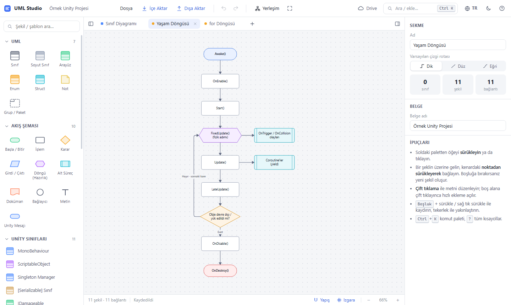

### 2. Şekilleri bağlama

Bir şeklin üzerine gelin (ya da seçin); etrafında küçük **mavi bağlantı noktaları** belirir. Bunlardan birinden sürükleyin:

- **Başka bir şeklin üzerine bırakırsanız** ikisi bağlanır.
- **Boş tuvale bırakırsanız** aynı türden, zaten bağlı yeni bir şekil oluşur ve hemen metnini yazmaya başlarsınız. Akış şeması kurmanın en hızlı yolu budur.

<p align="center">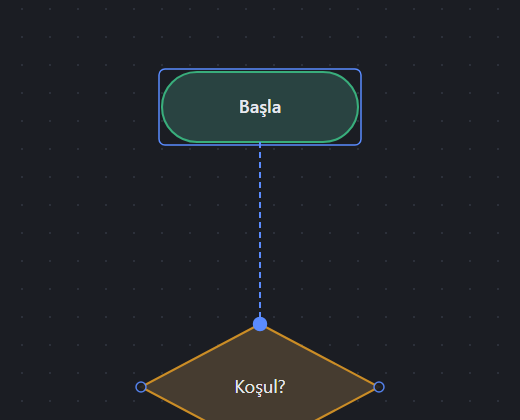</p>

Bağlantıların davranışı:
- **Karar** şeklinden çıkan oklar otomatik olarak **Evet / Hayır** diye etiketlenir.
- Bir bağlantıya tıklayınca sağ panelden türünü, etiketlerini, çokluklarını, rotasını (dik, düz, eğri) ve çizgi stilini değiştirebilirsiniz.
- Seçili bir çizginin ortasındaki baklava tutamacını sürükleyerek rotasını değiştirebilirsiniz.
- Çizginin uç tutamaçlarını sürükleyerek onu başka bir şekle bağlayabilirsiniz.

### 3. Sınıfları düzenleme ve Unity kısayolları

Bir sınıfı yerinde düzenlemek için **çift tıklayın**. Neyi düzenleyeceğiniz tıkladığınız yere göre değişir: başlık **adı**, orta bölüm **alanları**, alt bölüm **metotları** düzenler. Her şey **sağ panelden** de düzenlenebilir.

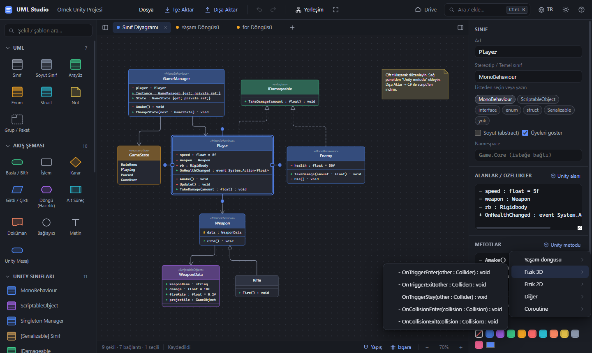

Sağ panelde şunlar var:
- **Stereotip düğmeleri:** sınıf türünü tek tıkla ayarlar (MonoBehaviour, ScriptableObject, interface, enum, struct, Serializable).
- **Unity metodu:** yaşam döngüsü, fizik (3D/2D), gizmo ve coroutine metotlarını doğru imzalarıyla ekler.
- **Unity alanı:** `Rigidbody`, `Animator`, `UnityEvent` ve singleton `Instance` gibi sık kullanılan bileşen ve değerleri ekler.
- **Kodu göster / .cs indir:** seçili sınıfın kodunu gösterir veya indirir.

### 4. Unity şablonları, desenleri ve döngüleri

Palette hazır yapı taşları bulunur:

- **Unity Sınıfları:** MonoBehaviour, ScriptableObject, Singleton Manager, `[Serializable]` sınıf, IDamageable, enum, soyut temel sınıf, Custom Editor, EditorWindow, statik yardımcı ve StateMachineBehaviour.
- **Unity Desenleri:** State, Observer/Event, Object Pool, ScriptableObject veri, Manager yapısı ve Command.
- **Unity Akışları & Döngüler:** MonoBehaviour yaşam döngüsü, `Update` ile input → hareket, `for`, `foreach`, `while`, `do-while`, `if/else`, `switch`, coroutine ile spawn, `OnTriggerEnter`, hasar al/öl ve raycast ile ateş etme.

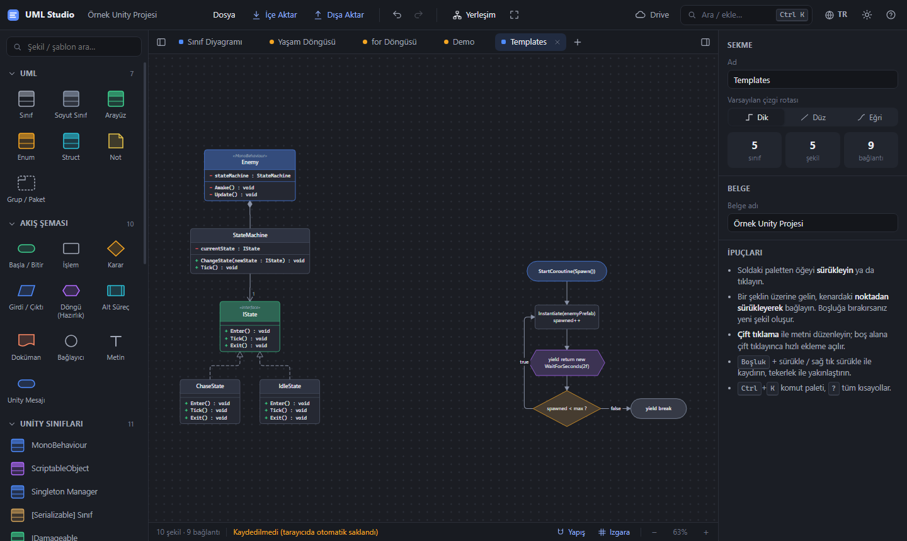

### 5. C# script'lerini dışa aktarma

Üretilen kodu görmek için **Dışa Aktar → C# kod önizleme**, tüm sınıfları `.cs` dosyası olarak indirmek için **Dışa Aktar → C# script'leri (.zip)** seçin.

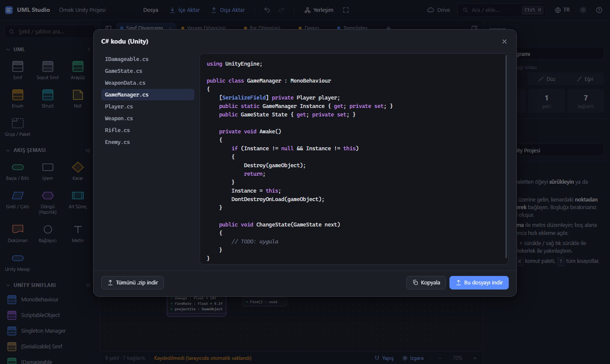

Kod üretici Unity alışkanlıklarını bilir:
- Unity sınıflarının private alanlarına `[SerializeField]` eklenir.
- ScriptableObject'lere `[CreateAssetMenu]` eklenir.
- Editor sınıflarına `[CustomEditor(typeof(...))]` eklenir ve bunlar `Editor/` klasörüne konur.
- Statik bir `Instance` özelliği ile `Awake()` metodu varsa singleton iskeleti yazılır.
- *Gerçekleme (realization)* çizgisiyle bağlı arayüzlerin metotları otomatik eklenir.
- `using` satırları yalnızca gerektiğinde eklenir.

### 6. Mevcut C# script'lerinizi içe aktarma

`.cs` dosyalarını ya da tüm `Assets/Scripts` klasörünü tuvale sürükleyip bırakın. **İçe Aktar → C# klasörü** ile de seçebilirsiniz. Açılan pencere neler bulunduğunu gösterir; private üyeleri, metotları ve referans ilişkilerini dahil edip etmemeyi seçebilirsiniz.

<p align="center">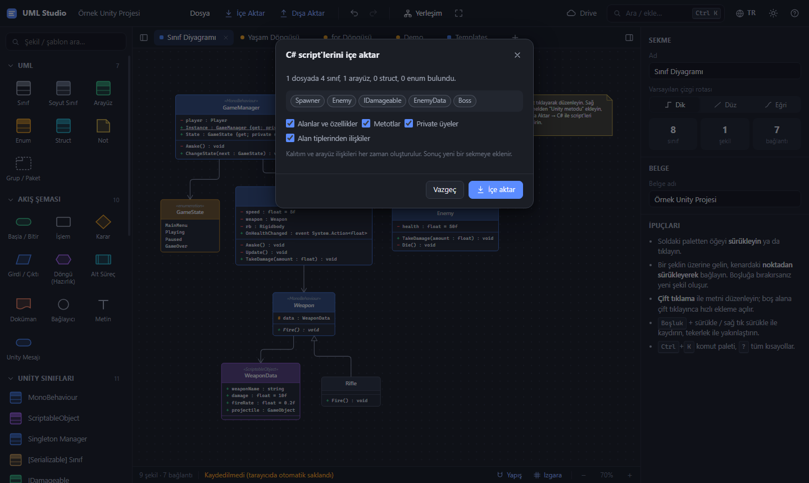 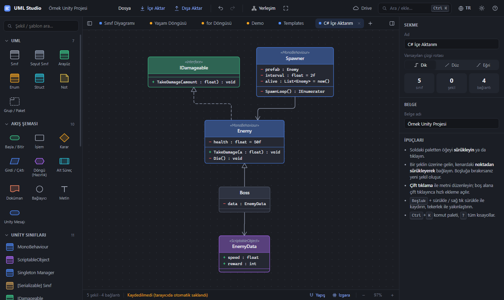</p>

Sonuç yeni bir sekmeye eklenir ve taban sınıflar üstte olacak şekilde otomatik yerleştirilir:
- Kalıtım ve arayüzler çizgiye dönüşür.
- Başka sınıflara referans veren alanlar ilişki çizgisi olur; koleksiyonlar `*` ile işaretlenir.
- Partial sınıflar tek sınıfta birleştirilir.
- `Library/`, `Temp/` ve `obj/` klasörleri atlanır.

### 7. Görsel ve metin olarak dışa aktarma

**Dışa Aktar** menüsünde şunlar var:

- **PNG:** canlı önizleme, koyu veya açık tema, şeffaf arka plan, 1–4× ölçek ve panoya kopyalama.
- **SVG:** vektör görsel.
- **Mermaid** (GitHub, GitLab, Notion, Obsidian için) ve **PlantUML** (yalnızca sınıf diyagramları).
- **JSON:** uygulamanın kendi belge biçimi; daha sonra tekrar açabilirsiniz.

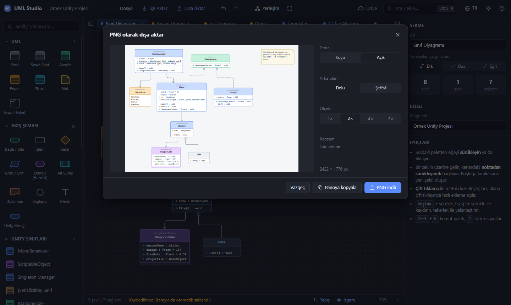

Dışa aktarılmış bir PNG örneği (açık tema):

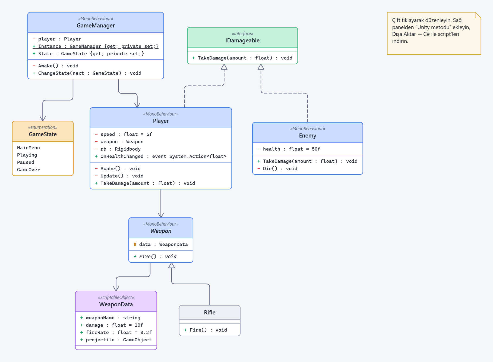

### 8. Google Drive senkronu

[Bir kerelik kurulumdan](#google-drive-kurulumu-bir-kerelik-5-dakika) sonra üst çubuktaki **Drive** düğmesiyle kendi Google hesabınızla giriş yapıp diyagramlarınızı Drive'ınıza kaydedebilirsiniz.

<p align="center">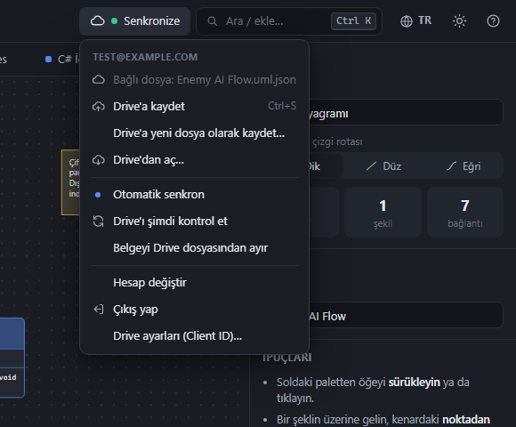 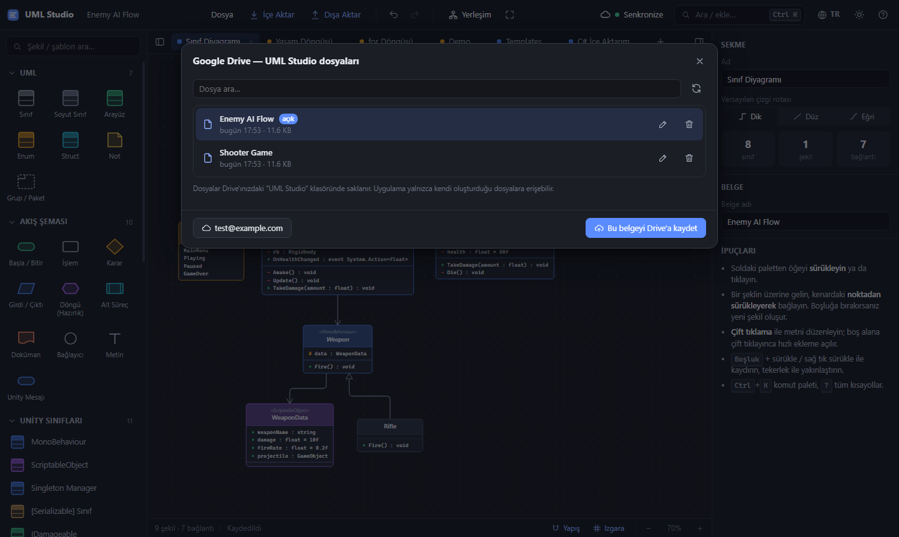</p>

**Tipik kullanım: bilgisayarda başla, tablette devam et**
1. Bilgisayarda **Drive → Google ile giriş yap**, ardından **Drive'a kaydet** seçin.
2. Bundan sonra her değişiklik birkaç saniye içinde **otomatik senkronlanır**. Gösterge *Senkronize* ya da *Senkron bekliyor* yazar. `Ctrl+S` de Drive'a kaydeder.
3. Tablette aynı adresi açın, **Drive → Drive'dan aç…** ile dosyayı seçin.
4. Bir cihaza geri döndüğünüzde uygulama Drive'ı kontrol eder. O cihazda değişiklik yapmadıysanız yeni sürümü kendiliğinden yükler.
5. Aynı belge **iki cihazda da** kaydedilmeden değiştirildiyse bir çakışma penceresi açılır: *Drive'dakini aç*, *Üzerine yaz* ya da *Benimkini kopya olarak kaydet* (hiçbir şey kaybolmaz).

Google erişim anahtarı yaklaşık bir saat geçerlidir. Süresi dolunca gösterge *Giriş gerekli* yazar; tek tıkla yeniden bağlanırsınız.

### 9. Tablet ve telefon

<p align="center">
  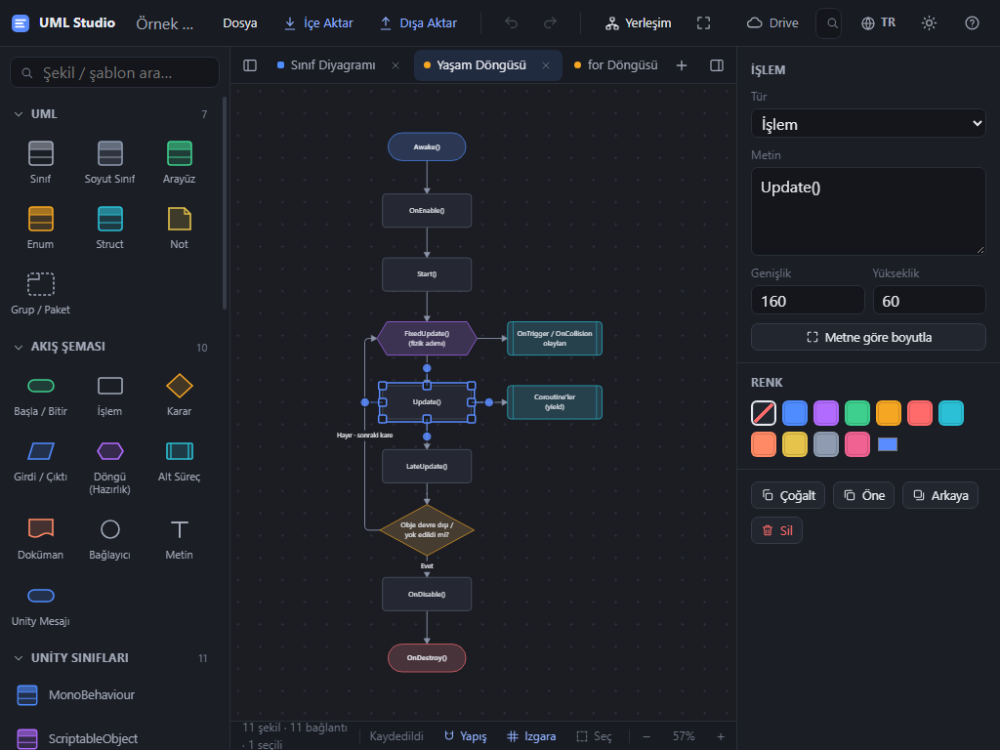
  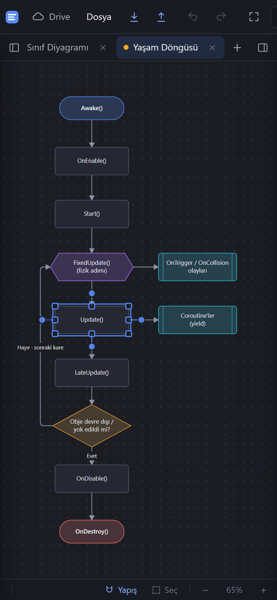
  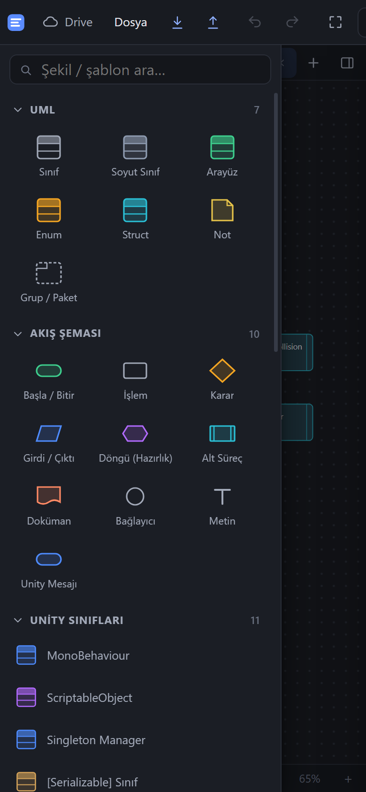
</p>

| Hareket | Ne yapar |
|---|---|
| Şekle dokunmak | Seçer |
| Şekli sürüklemek | Taşır |
| Boş tuvali sürüklemek | Kaydırır |
| İki parmak | Yakınlaştırır/uzaklaştırır ve kaydırır |
| Çift dokunuş | Metni düzenler (boş alanda: hızlı ekleme) |
| Uzun basış | Bağlam menüsü (*Özellikler* sağ paneli açar) |
| Seçili şeklin etrafındaki mavi noktayı sürüklemek | Bağlantı çizer |
| Alt çubuktaki **Seç** düğmesi | Çoklu seçim modu: dokunarak seçime ekleyin, boş alanda sürükleyerek çerçeveyle seçin |

Küçük ekranlarda palet ve özellikler paneli yandan açılan çekmecelere dönüşür; sekme çubuğundaki düğmelerle açılır. Tarayıcı menüsünden **Ana ekrana ekle** seçerek uygulamayı kurabilirsiniz; internet yokken de açılır.

### 10. Komut paleti ve klavye kısayolları

Tüm şekilleri, Unity şablonlarını ve komutları aramak için `Ctrl+K` (ya da `/`) tuşuna basın.

<p align="center">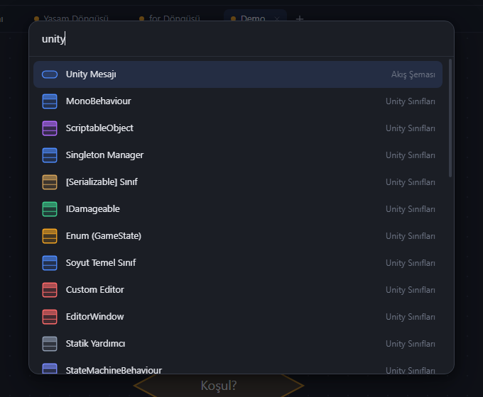</p>

| Kısayol | Ne yapar |
|---|---|
| `Ctrl+S` / `Ctrl+Shift+S` | Kaydet (belge Drive'a bağlıysa Drive'a) / Dosyaya farklı kaydet |
| `Ctrl+O` | Dosya aç |
| `Ctrl+K`, `/` | Komut paleti / hızlı ekleme |
| `Ctrl+Z`, `Ctrl+Y` | Geri al / yinele |
| `Ctrl+C` `Ctrl+X` `Ctrl+V` `Ctrl+D` | Kopyala / kes / yapıştır / çoğalt |
| `Ctrl+A`, `Delete` | Tümünü seç, sil |
| `F2` veya `Enter` | Seçili şekli ya da çizgiyi düzenle |
| Ok tuşları (+`Shift`) | 1 px (10 px) kaydır |
| `Ctrl+G` | Seçimi bir çerçevede grupla |
| Fare tekerleği | Yakınlaştır |
| `Boşluk` + sürükle, orta/sağ tık sürükle | Kaydır |
| `Shift+1`, `Ctrl+0` | Ekrana sığdır, %100 |
| Sürüklerken `Alt` | Yapışmayı geçici olarak kapat |
| `?` | Tüm kısayolları göster |

Çerçeveyle seçim çoğu CAD programındaki gibi çalışır: sağa doğru sürüklerseniz çerçevenin **tamamen içinde kalan** şekiller, sola doğru sürüklerseniz çerçevenin **değdiği** şekiller seçilir.

---

## Üye yazımı

Sınıf üyeleri basit, UML tarzı bir yazımla girilir. C# tarzı satırlar da kabul edilir.

```text
- speed : float = 5f                                  varsayılan değerli private alan
+ Health : int {get; private set;}                    özellik (property)
+ {static} Instance : GameManager {get; private set;} statik özellik
+ Move(dir : Vector3, speed : float) : void           metot
+ {abstract} Fire() : void                            soyut metot ({virtual} ve {override} de çalışır)
+ OnDied : event Action<int>                          olay (event)
public float speed = 5f                               C# tarzı da olur
```

Görünürlük: `+` public · `-` private · `#` protected · `~` internal.
Enum'larda her satıra bir değer yazın.

---

## GitHub Pages ile yayınlama

1. GitHub'da yeni bir depo oluşturun (ör. `uml-studio`). Ücretsiz hesapta Pages kullanmak için depo **public** olmalıdır.
2. Bu klasörü deponun köküne gönderin:
   ```bash
   git init
   git add .
   git commit -m "UML Studio"
   git branch -M main
   git remote add origin https://github.com/KULLANICI_ADINIZ/uml-studio.git
   git push -u origin main
   ```
3. Depoda **Settings → Pages → Build and deployment** bölümünde **Source** olarak *Deploy from a branch*, **Branch** olarak `main` ve klasör olarak `/ (root)` seçip **Save**'e tıklayın.
4. Bir iki dakika sonra uygulama `https://KULLANICI_ADINIZ.github.io/uml-studio/` adresinde yayında olur.

Güncelleme yayınlamak için değişiklikleri commit edip `git push` yapmanız yeterli. Service worker her zaman önce en yeni dosyaları indirir; kullanıcılar güncellemeyi bir sonraki ziyarette alır.

> [!TIP]
> Commit'ler yazarın e-posta adresini içerir ve public depoda herkes görebilir. Kişisel adresinizin görünmesini istemiyorsanız GitHub'da **Settings → Emails → Keep my email addresses private** seçeneğini açın ve orada gösterilen `...@users.noreply.github.com` adresini `git config user.email` ile ayarlayın.

---

## Google Drive kurulumu (bir kerelik, ~5 dakika)

Drive senkronu için Google Cloud'dan kendinize ait ücretsiz bir OAuth Client ID almanız gerekir.

1. <https://console.cloud.google.com> adresinde yeni bir proje oluşturun.
2. **APIs & Services → Library → Google Drive API → Enable.**
3. **Google Auth Platform** (eski adıyla *OAuth consent screen*) bölümünde:
   - **Branding:** uygulama adını ve e-posta adresinizi girin. *User support email* alanındaki adres giriş yapan herkese gösterilir; kişisel adresinizi göstermek istemiyorsanız ayrı bir hesap kullanın.
   - **Audience:** **External** seçin. Uygulama *Testing* durumundayken yalnızca **Test users** listesindeki hesaplar giriş yapabilir; kendi Google hesabınızı ekleyin. Uygulamanızı **herkesin** kullanabilmesi için **Publish app** ile *In production* durumuna alın. Uygulama yalnızca `drive.file` izni kullandığından, Google'ın şu anki kurallarına göre bu izin hassas sayılmıyor ve uygulama incelemesi gerekmiyor.
   - **Data access:** `https://www.googleapis.com/auth/drive.file` kapsamını ekleyin.
4. **Clients → Create client → Web application.**
   - **Authorized JavaScript origins:** `https://KULLANICI_ADINIZ.github.io`. Yerelde denemek için `http://localhost:8000` adresini de ekleyin.
   - Redirect URI gerekmez.
5. Client ID'yi `js/config.js` dosyasına yazın:
   ```js
   window.UMLSTUDIO_CONFIG = {
     googleClientId: '1234567890-abc...apps.googleusercontent.com',
   };
   ```
   Client ID **gizli bir bilgi değildir**, depoya eklenmesinde sakınca yoktur. Google konsolunun gösterebileceği *client secret* ise bu uygulamada kullanılmaz; onu hiçbir yere yazmayın. Client ID'yi isterseniz uygulamada **Drive → Drive ayarları (Client ID)…** penceresine de yapıştırabilirsiniz; o zaman yalnızca o tarayıcıda saklanır.

Google Cloud projesi, Drive API ve GitHub Pages ücretsizdir; faturalandırma hesabı gerekmez. Her kullanıcının dosyaları kendi Drive kotasında saklanır.

---

## Gizlilik

Tam metinler: [Gizlilik Politikası](privacy.html) ve [Kullanım Koşulları](terms.html) (İngilizce). İkisi de uygulamanın alt durum çubuğundan açılabilir.

- **Sunucu, analiz ya da takip yoktur.** Uygulama yalnızca statik dosyalardan oluşur.
- Çalışmalarınız her cihazda **tarayıcının yerel depolamasına** otomatik kaydedilir.
- Drive senkronu tarayıcınızdan doğrudan Google'a bağlanır ve **`drive.file`** iznini kullanır. Bu izinle uygulama yalnızca kendi oluşturduğu dosyaları görebilir; Drive'ınızdaki başka hiçbir şeyi okuyamaz. Dosyalar **UML Studio** klasöründe saklanır.
- Uygulamayı yayınlayan kişi (depo sahibi) kullanıcıların dosyalarını göremez; veriler onun üzerinden geçmez.
- Google erişim anahtarı, sayfayı yenileyince tekrar giriş gerekmesin diye geçerlilik süresi boyunca (yaklaşık bir saat) yerel depolamada tutulur. **Çıkış yap** bu anahtarı iptal eder.

---

## Proje yapısı

```text
index.html              Uygulama iskeleti
css/style.css           Arayüz stilleri (koyu/açık tema, duyarlı yerleşim)
js/config.js            Ayarlar (Google Client ID)
js/i18n.js              Türkçe/İngilizce çeviriler ve dil algılama
js/util.js, theme.js    Yardımcılar, diyagram renk temaları
js/uml.js, model.js     UML meta verisi, üye ayrıştırıcı, belge modeli, geri al/yinele
js/geometry.js          Şekil boyutları, bağlantı noktaları, çizgi rotaları
js/render.js            SVG çizimi (PNG/SVG dışa aktarmada da kullanılır)
js/layout.js            Otomatik katmanlı yerleşim
js/templates.js         Palet öğeleri: şekiller, Unity sınıfları, desenler, akışlar
js/csharp.js            C# kod üretici ve C# ayrıştırıcı
js/mermaid.js           Mermaid içe/dışa aktarma, PlantUML dışa aktarma
js/zip.js               Bağımlılıksız ZIP yazıcı
js/io.js                Dosya kaydet/aç, görsel dışa aktarma
js/ui.js, panel.js      Menüler, pencereler, özellikler paneli
js/editor.js            Tuval etkileşimi (fare, dokunma, iki parmak, klavye)
js/drive.js             Google Drive senkronu
js/app.js               Araç çubuğu, sekmeler, palet, eylemler, başlatma
sw.js, manifest.webmanifest, icons/   Çevrimdışı kullanım ve kurulabilir uygulama
tests/                  Mantık modülleri ve çeviri kapsamı testleri
docs/images/            README ekran görüntüleri (tr/ klasörü Türkçe arayüz)
```

Bağımlılık ve derleme adımı yoktur: `<script>` etiketleriyle yüklenen düz JavaScript.

---

## Testleri çalıştırma

```bash
node tests/run-tests.js
```

Testler şunları kapsar: üye ayrıştırıcı, çeviri kapsamı (her arayüz metninin İngilizce karşılığı var mı), C# içe ve dışa aktarma (her şablondan kod üretip tekrar ayrıştıran gidiş-dönüş testi dahil), Mermaid içe ve dışa aktarma, her şablon için çizgi geometrisi, otomatik yerleşimde çakışma kontrolü, geri al/yinele ve ZIP yazıcı.

---

## Yeni dil ekleme

Arayüzdeki tüm metinler [`js/i18n.js`](js/i18n.js) içindeki `$t('…')` fonksiyonundan geçer. Türkçe kaynak metin anahtardır; her dil, bu anahtarları çevirilerine eşleyen bir sözlüktür. Yeni dil eklemek için:

1. `js/i18n.js` içindeki `EN` sözlüğünü kopyalayın, değerleri çevirin ve `DICTS` ile `LANGS` listelerine ekleyin.
2. Yeni dilin otomatik seçilmesini istiyorsanız `systemLang()` fonksiyonunu güncelleyin.
3. `node tests/run-tests.js` çalıştırın. Kodda kullanılan bir anahtar İngilizce sözlükte yoksa, bir çeviride `{yer_tutucu}` ya da `**kalın**` işareti kaybolmuşsa veya koddaki bir Türkçe metin `$t()` içine alınmamışsa testler başarısız olur.

---

## Bilinen kısıtlar

- Yalnızca Türkçe ve İngilizce var. Yeni dil eklemek `js/i18n.js` dosyasına bir sözlük eklemek demektir (bkz. [Yeni dil ekleme](#yeni-dil-ekleme)).
- C# içe aktarıcı bir derleyici değil, hafif bir ayrıştırıcıdır. Tipik Unity kodunu iyi okur, ama alışılmadık sözdiziminde bazı üyeleri atlayabilir.
- PlantUML dışa aktarma yalnızca sınıf diyagramlarını destekler. Akış şemaları için Mermaid kullanın.
- Bir karar şeklinin aynı köşesinde birden fazla çizgi buluşursa üst üste binebilir. Çizginin ortadaki tutamacıyla rotasını değiştirin ya da özellikler panelinden çıkış/giriş kenarını sabitleyin.
- iOS'ta ana ekrana eklenmiş uygulamada Google girişi bazen sorun çıkarabilir. Öyle olursa girişi bir kez Safari'den yapın.
- Gerçek Google girişi ve fiziksel tabletler otomatik testlere dahil değildir. Drive senkronu taklit edilmiş bir Drive API ile, dokunmatik kullanım ise emüle edilmiş cihazlarla test edildi.

---

## Lisans

Bu proje [MIT Lisansı](LICENSE) ile lisanslanmıştır.
